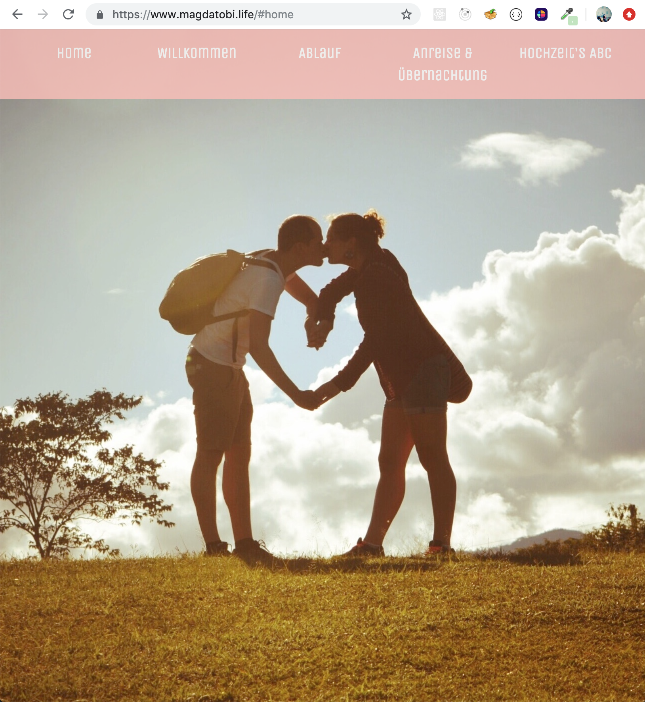

# Wedding Page for Magda and Tobi
## [Check out the deployed version here!](https://www.magdatobi.life/)
## What this project is about

Before the academy I practiced my HTML and styling skills to create this responsive page for my friends.

## Technologies used

- HTML
- CSS  
- Bootstrap

## Goals for this project:

- To practice
- To create a nice informational wedding page for my friends

